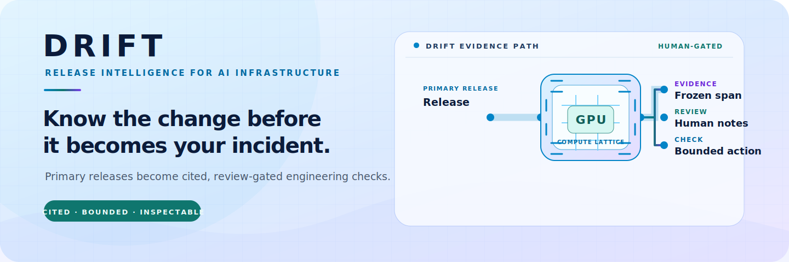
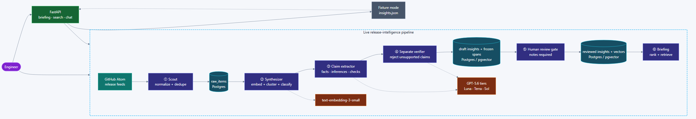
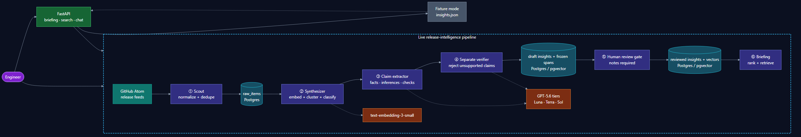

# DRIFT

<p align="center">
  <picture>
    <source media="(prefers-color-scheme: dark)" srcset="assets/brand/drift-banner-dark.svg">
    <source media="(prefers-color-scheme: light)" srcset="assets/brand/drift-banner-light.svg">
    
  </picture>
</p>

[](https://github.com/iarjunganesh/drift/actions/workflows/ci.yml)
[](https://codecov.io/gh/iarjunganesh/drift)
[](https://github.com/iarjunganesh/drift/releases)
[](LICENSE)
[](#live--interactive-demo)

[](https://www.python.org/)
[](https://fastapi.tiangolo.com/)
[](https://www.postgresql.org/)
[](https://github.com/pgvector/pgvector)
[](https://platform.openai.com/)
[](https://docs.astral.sh/ruff/)

[](https://nextjs.org/)
[](https://react.dev/)
[](https://nodejs.org/)
[](https://drift-api-prod.up.railway.app/docs)
[](https://dr1ftless.vercel.app)

---

## What Is This?

DRIFT is release intelligence for GPU and AI-infrastructure teams. It turns
upstream release-note noise into a cited, engineer-ready answer:

> **What changed? Why does it matter to my workload? What should I check?**

The first vertical slice is fixture-first and deterministic. The target system
will watch primary release feeds, rank meaningful changes, explain workload
impact, and return a bounded next engineering check without presenting model
output as a deployment verdict.

Built for **OpenAI Build Week 2026 · Developer Tools**.

---

## The Problem

GPU and AI platforms depend on fast-moving projects such as PyTorch, TensorRT,
Triton, vLLM, Transformers, CUTLASS, JAX, and NCCL. A small upstream change can
alter an image, benchmark, CUDA assumption, or deployment template, but release
review is usually a stream of links and scattered human memory.

DRIFT keeps the useful middle layer visible: source evidence, a plain-language
summary, workload relevance, confidence, severity, and one concrete action to
check. It does not certify compatibility, replace release notes, or authorize
production changes.

---

## How It Works

1. **Scout** reads configured primary release feeds and normalizes source items.
2. **Synthesizer** deduplicates, embeds, clusters, and classifies substantive
   changes.
3. **Insight** extracts typed direct facts, inferences, and recommended checks
   with exact source spans.
4. **Verifier** separately rejects unsupported or misclassified claims.
5. **Human review** promotes only verifier-passed drafts with recorded notes.
6. **Briefing** ranks reviewed changes and grounds search/chat in retrieved
   DRIFT evidence.
7. **FastAPI** exposes the briefing, search, chat, health, and generated OpenAPI
   contract.

The currently working path substitutes committed examples for the unfinished
live stages:

```text
backend/fixtures/insights.json → InsightStore → FastAPI → briefing/search/chat
```

Fixture records are explicitly labelled examples. They are never described as
fresh live release analysis.

---

## Architecture

<p align="center">
  <a href="assets/architecture/architecture-diagram-light.svg" target="_blank" rel="noopener noreferrer">
    <picture>
      <source media="(prefers-color-scheme: dark)" srcset="assets/architecture/architecture-diagram-dark.svg">
      <source media="(prefers-color-scheme: light)" srcset="assets/architecture/architecture-diagram-light.svg">
      
    </picture>
  </a>
</p>

<sub>Click to enlarge: <a href="assets/architecture/architecture-diagram-light.svg">light SVG</a> / <a href="assets/architecture/architecture-diagram-dark.svg">dark SVG</a> · Downloadable <a href="assets/architecture/architecture-diagram-light.png">light PNG</a> / <a href="assets/architecture/architecture-diagram-dark.png">dark PNG</a> · Source: <a href="assets/architecture/architecture-diagram.mmd"><code>architecture-diagram.mmd</code></a></sub>

**In short:** the fixture path is complete and no-key. The local live path now
persists source evidence, generates and separately verifies claim-grounded
drafts, embeds them, and retains two model-run audits. Drafts are quarantined;
only a human reviewer can publish them, and live read paths filter to reviewed,
verifier-passed records. On 2026-07-15, the prior hosted `v0.5.1` deployment
migrated Railway PostgreSQL and served one bounded, unreviewed vLLM capture
through `/briefing`. On 2026-07-16, Railway PostgreSQL was verified through
`0003_claim_evidence_review_gate` using its public TCP proxy. Later that day,
the hosted `v0.6.1` app passed `/health`, an empty fail-closed `/briefing`,
`/docs`, Vercel canonical-banner source, and Vercel-to-Railway CORS checks. It
then published four human-reviewed Insights (Transformers v5.14.1, vLLM v0.25.1,
NCCL v2.30.7-1, TensorRT 11.1) through the review gate, and hosted `/briefing`,
`/search`, and `/chat` were verified provider-backed — `/chat` returning a
grounded `gpt-5.6-terra` answer with primary-source citations. This is a small,
bounded reviewed set, not a broad live-release-analysis claim.

> **Deep dive** → [`docs/ARCHITECTURE.md`](docs/ARCHITECTURE.md) — runtime paths, stage
> ownership, provenance, retrieval, safety invariants, failure handling, and
> the Vercel/Railway deployment topology.

### Codex project initiatives

The baseline, publication follow-up, bounded release milestones, and
documentation follow-up are tied to nine project initiatives. The grounded
live-chat row remains the primary v0.4.0 implementation session; v0.5.0 adds
the bounded local capture path.

| Initiative | Session ID | Focus |
| --- | --- | --- |
| Foundation and inspectable vertical slice | `019f61e7-1ea1-7742-9acc-99d62f39b888` | Fixture API, typed contracts, agent boundaries, safety invariants, tests |
| Publication and judge-readiness baseline | `019f61fc-c32e-7d92-9d2e-0bd9083d08e7` | Documentation, architecture assets, CI/Codecov, deployment and submission surfaces |
| Hosted deployment and README follow-up | `019f6253-ddfc-7272-8077-e34dfb3aee84` | Railway/Vercel URLs, release badges, and public demo documentation |
| Day 1/Day 2 implementation follow-up | `019f62e8-6715-70e2-a92a-fe28254f7b71` | Scout feeds, async PostgreSQL/pgvector foundation, Tier.DEV embeddings/clustering/classification, session instructions, and status cleanup |
| Grounded live chat, resilience, and locked delivery | `019f62b9-10b7-7d82-a463-e6eb1192141c` | Primary `0.2.0` candidate work: local live chat, async safeguards, locked delivery, and full implemented-code coverage |
| Day 3/Day 4 Insight structured output | `019f6336-3690-7022-a8ef-c8c0947e240f` | Standalone `generate_insight()` structured parsing, strict validation, citations, confidence, and model provenance |
| Bounded capture, provenance, and status cleanup | `019f66b4-78b8-7943-a41d-91e836d28f00` | One-shot persisted capture, all-call budget/retry controls, live briefing adapter, evidence UI, and documentation synchronization |
| Grounding guardrails and capture readiness | `019f6773-0e96-7363-9657-0e0531c3d594` | Claim spans/hashes, separate verifier, review-gated publication, cross-references, calibration cases, manual notebook, and all-source capture preflight |
| Submission audit and frontend evidence presentation | `019f6a46-e3eb-7de2-81b1-91515ae80043` | Handwritten-next-step audit, explicit briefing states, system-theme presentation, canonical API-served banners, and status synchronization |

See the full [project initiative record](docs/INITIATIVES.md).

### How Codex and GPT-5.6 were used

Codex was used to build and audit the typed FastAPI stages, fixture contracts,
tests, deployment files, architecture records, and the bounded async
model-call path. The primary core-functionality session is
`019f62b9-10b7-7d82-a463-e6eb1192141c`; the Day 1/Day 2 implementation
follow-up session is `019f62e8-6715-70e2-a92a-fe28254f7b71`. The earlier
initiative records preserve the foundation, publication, and hosted-demo work;
the Day 3/Day 4 Insight implementation session is
`019f6336-3690-7022-a8ef-c8c0947e240f`; the grounding guardrail and
capture-readiness follow-up is `019f6773-0e96-7363-9657-0e0531c3d594`; and the
submission-audit/frontend-presentation follow-up is
`019f6a46-e3eb-7de2-81b1-91515ae80043`.

GPT-5.6 is used only when an operator explicitly enables `DRIFT_MODE=live` and
provides an API key. The local capture job routes embeddings, classification,
claim drafting, and a separate verifier through the bounded provider boundary;
it records source hashes, exact evidence spans, upstream references, and both
model-run audits. The verifier is model-aided screening, not proof: a human
must review and publish the draft before it can appear in live endpoints.
Fixture mode makes no provider call. One paid, unreviewed vLLM capture is
recorded as historical scrubbed evidence from the previous hosted deployment;
it is not broad live-release analysis or evidence that the new gate is hosted.

### Architecture Decision Records

Ten decisions currently constrain the implementation. They are intentionally
short; the architecture document explains how they compose.

| ADR | Decision |
| --- | --- |
| [001](docs/adr/001-fixture-first-judge-path.md) | Fixture-first judge path with an honest live boundary |
| [002](docs/adr/002-typed-agents-no-framework.md) | Typed hand-rolled stages instead of a heavyweight agent framework |
| [003](docs/adr/003-citations-and-visible-uncertainty.md) | Citations, confidence, audit labels, and uncertainty are visible |
| [004](docs/adr/004-local-budget-guard.md) | Local spend guard around live iteration |
| [005](docs/adr/005-postgres-pgvector-live-store.md) | PostgreSQL + pgvector for the live store |
| [006](docs/adr/006-ci-quality-gates.md) | CI gates with a 100% implemented-code floor |
| [007](docs/adr/007-vercel-railway-deployment.md) | Vercel frontend + Railway API/database deployment shape |
| [008](docs/adr/008-live-grounded-chat.md) | Live grounded chat over the cited fixture store |
| [009](docs/adr/009-bounded-model-resilience-and-locked-delivery.md) | Bounded model resilience and locked delivery |
| [010](docs/adr/010-claim-evidence-and-review-gate.md) | Claim-level evidence, separate verification, and review-first publication |

---

## Model Router & Safety Boundary

Provider calls belong behind [model_router.py](backend/core/model_router.py).
Agent code must not hard-code provider model names. The intended tiers are:

| Tier | Intended job | Status |
| --- | --- | --- |
| `dev` / Luna | Classification, clustering, and prompt iteration | Produced the four reviewed Insights published 2026-07-16; run only with an explicit live key |
| `live` / Terra | Retrieve-first grounded chat | Serves hosted grounded chat over reviewed pgvector rows; verified provider-backed 2026-07-16 |
| `final` / Sol | Three to five reviewed demo insights | Reserved; the 2026-07-16 demo set was captured at the `dev`/Luna tier to bound cost |

Every live insight must preserve:

- one or more typed claims with frozen exact primary-source excerpts, offsets,
  and source hashes;
- direct facts distinct from inferences and recommended checks;
- confidence in `[0, 1]`;
- the exact model identifier or an explicit fixture audit label; and
- a concrete, bounded `what_to_check` action.

Release text is untrusted data. It can be summarized and reasoned over, but it
must never become model instructions or authorization to act on infrastructure.
`breaking` and `security` are review priorities, not automation triggers.
Upstream release type is separate from potential operator risk; neither is a
compatibility verdict.

The local [SpendGuard](backend/core/budget.py) is a development safeguard;
provider-side limits remain required for a deployed service.

Live model requests are additionally bounded by a retry envelope, local spend
reservation, configured client timeout, and a closed/open/half-open circuit
breaker. Interactive chat also has a queue timeout and concurrency bulkhead. A
cancelled, failed, or usage-unknown provider attempt is accounted for
conservatively; it is never silently treated as free.

---

## Tech Stack

| Layer | Technology | Role |
| --- | --- | --- |
| **Backend** | [](https://fastapi.tiangolo.com/) [](https://www.python.org/) | Typed HTTP API and explicit pipeline stages |
| **Contracts** | [](https://docs.pydantic.dev/) | Typed raw-item, insight, briefing, and chat contracts |
| **Agent Pattern** | [](backend/agents/base.py) | Small lifecycle-wrapped functions; no orchestration framework |
| **Release Feeds** | [](https://feedparser.readthedocs.io/) [](https://pyyaml.org/) | Configured primary-source feed definitions and parsing |
| **Live Store** | [](https://www.postgresql.org/) [](https://github.com/pgvector/pgvector) | Durable raw items, insights, and vector retrieval |
| **Model Boundary** | [](https://platform.openai.com/) | Provider isolation, model tiers, and budget control |
| **Quality** | [](https://docs.astral.sh/ruff/) [](https://docs.pytest.org/) [](https://codecov.io/) | Lint, types, tests, coverage evidence, and CI enforcement |
| **Frontend** | [](https://nextjs.org/) [](https://react.dev/) [](https://www.typescriptlang.org/) | Operator-facing briefing view |
| **Hosting** | [](https://railway.app/) [](https://vercel.com/) | Railway API/database; Vercel Next.js frontend |
| **Observability** | [](https://www.structlog.org/) | Structured logs and explicit request/stage boundaries |

Python dependencies are declared in [pyproject.toml](pyproject.toml) and
resolved once in [uv.lock](uv.lock); local, CI, and container installs all use
that frozen lockfile. JavaScript dependencies are locked in
[frontend/package-lock.json](frontend/package-lock.json).

---

## Live & Interactive Demo

The Railway API and Vercel frontend are live. The Vercel project deploys from
`frontend/` using its checked-in build configuration. On 2026-07-16, hosted
`v0.6.1` verified the briefing-state and canonical-banner release after Railway
PostgreSQL reached the review-gate migration. The API-docs banner frame follows
the same system light/dark preference as the canonical banner.

| | |
| --- | --- |
| **Current hosted API** | `v0.6.1` `live` — `/health`, `/briefing` (four reviewed Insights), `/search`, `/chat`, `/docs`, and Vercel-origin CORS verified provider-backed on 2026-07-16 |
| **Hosted frontend source** | Vercel HTML references the canonical API-served light/dark banner pair; the browser post-fetch empty-state rendering is not separately recorded |
| **API docs branding** | The Swagger banner frame and canonical banner pair follow the same system light/dark preference |
| **Historical evidence** | `v0.5.1` `live` — one unreviewed vLLM Insight served through `/briefing` on 2026-07-15; retained as pre-gate evidence only |
| **Database schema** | Railway PostgreSQL verified at `0003_claim_evidence_review_gate` through its public TCP proxy on 2026-07-16 |
| **Frontend** | [https://dr1ftless.vercel.app](https://dr1ftless.vercel.app) |
| **API** | [https://drift-api-prod.up.railway.app](https://drift-api-prod.up.railway.app) |
| **Swagger** | [`/docs`](https://drift-api-prod.up.railway.app/docs) |
| **OpenAPI** | [`/openapi.json`](https://drift-api-prod.up.railway.app/openapi.json) |
| **Briefing** | [`/briefing`](https://drift-api-prod.up.railway.app/briefing) |
| **Demo Video** | [`https://youtu.be/TBD`](https://youtu.be/TBD) *(≤ 3 min, record before submission)* |
| **Public demo** | Vercel frontend and Railway API are live; Vercel-to-Railway CORS was reverified on 2026-07-16 |

One unreviewed real-model vLLM capture is saved as historical hosted evidence.
The fixture path remains the reproducible no-key demo. The review-gated code
is deployed with its Railway schema migration. On 2026-07-16 an eight-source
capture produced six verifier-passed drafts; four were published after human
review, so hosted `/briefing`, `/search`, and `/chat` now serve those four
reviewed Insights (verified provider-backed). This is a small, bounded reviewed
set, not broad live-release analysis.

The Swagger contract groups the backend into **System**, **Briefing**,
**Search**, and **Chat** sections so reviewers can navigate the API by job.

---

## Screenshots & Evidence

The architecture assets are the current visual evidence and are available in
both SVG and PNG formats:

The scrubbed hosted capture evidence is stored separately in
[`assets/evidence/`](assets/evidence/), including the verified unreviewed vLLM
briefing response and its explicit operational limitations. After a human
publishes a new notebook capture, its archive cell writes a new dated reviewed
record and SHA-256 manifest there without including review notes or secrets.

| Light | Dark |
| --- | --- |
| [](assets/architecture/architecture-diagram-light.svg) | [](assets/architecture/architecture-diagram-dark.svg) |

The Next.js briefing view exposes each record's status label, confidence,
model/audit label, rationale, bounded action, source links, and—when present—
claim-type evidence. On 2026-07-16, the hosted UI was verified against the
review-gated API; reviewed evidence has since been published, so `/briefing`
now serves four reviewed Insights instead of the intentional empty state. The
local `v0.6.1` theme and briefing-state corrections still require a Vercel
deployment before they become hosted verification facts.

---

## Quick Start

Requirements: Python 3.14, `uv`, and Node.js 24.x for the frontend.

```powershell
# 1. Clone the public repository
git clone https://github.com/iarjunganesh/drift.git
cd drift

# 2. Configure the no-key fixture path
Copy-Item .env.example .env

# 3. Install locked Python dependencies
uv venv .venv
uv sync --locked --group dev

# 4. Start the API
uv run uvicorn backend.main:app --reload
```

Open <http://127.0.0.1:8000/docs>, or try:

```powershell
Invoke-RestMethod http://127.0.0.1:8000/health
Invoke-RestMethod http://127.0.0.1:8000/briefing
Invoke-RestMethod http://127.0.0.1:8000/search?q=vllm
Invoke-RestMethod http://127.0.0.1:8000/chat `
  -Method Post -ContentType application/json `
  -Body '{"question":"What should I check for vLLM?"}'
```

Run the frontend in another terminal:

```powershell
npm --prefix frontend ci
npm --prefix frontend run dev
```

Set `NEXT_PUBLIC_API_URL` in `frontend/.env.local` if the API is not on
`http://localhost:8000`.

For the durable PostgreSQL path, start the configured database and run
`make migrate` (or `uv run alembic upgrade head`) before connecting a live
store. The fixture path does not require a database.

For a judge-ready all-source demonstration, use the **DRIFT Manual Run** in
[`notebooks/drift_manual_run.ipynb`](notebooks/drift_manual_run.ipynb). It makes
the proof chain visible—source roster, spend-gated capture, frozen evidence,
human review, and immutable archive—while starting with one item per configured
source (at most eight). It creates drafts only and has a separate
empty-by-default human publication cell. It needs local
PostgreSQL or an operator-provided public/tunneled database URL; Railway's
private `postgres.railway.internal` hostname cannot be resolved from a local
notebook. When Railway provides a public TCP proxy, retain its complete private
`DATABASE_URL` and set `DRIFT_DATABASE_PUBLIC_HOST`/
`DRIFT_DATABASE_PUBLIC_PORT`; DRIFT replaces only the host and port locally.
Launch it with
`uv run --with jupyterlab jupyter lab notebooks/drift_manual_run.ipynb`.

The underlying capture command is also draft-only. Enable live mode, provide
an API key, and select a deliberately small source set. Start with `dev` for
prompt iteration and use `final` only for selected, already-reviewed sources:

```powershell
$env:DRIFT_MODE='live'
uv run python -m backend.pipeline --source vllm --source tensorrt --source pytorch --tier dev
```

This command makes paid provider calls and writes quarantined draft rows. It is
not a scheduled feed service and does not publish or verify the hosted deployment.

---

## Synthetic Fixture Data

The fixture path uses [`backend/fixtures/insights.json`](backend/fixtures/insights.json).
These records are committed examples for deterministic development and judging;
they are not current release analysis. Each record preserves the contract that
the live path must also satisfy:

| Field | Purpose |
| --- | --- |
| `citations` | Source URLs supporting the insight |
| `confidence` | Visible certainty in `[0, 1]` |
| `model_used` | Fixture audit label or exact live model identifier |
| `what_to_check` | Bounded engineering action |
| `severity` | Review priority, never an automation trigger |

---

## Project Structure

```text
drift/
├── backend/
│   ├── agents/          # Base, Scout, Synthesizer, Insight, and Briefing stages
│   ├── core/            # Settings, model router, fixture store, and SpendGuard
│   ├── fixtures/        # Deterministic citation-backed example insights
│   ├── models/           # Pydantic domain and API contracts
│   ├── main.py           # FastAPI app: health, briefing, search, chat
│   ├── pipeline.py        # Bounded one-shot live capture CLI
│   ├── review.py          # Explicit human publication gate
│   ├── sources.yaml      # Primary release-feed configuration
├── frontend/             # Next.js + React + TypeScript briefing view
│   ├── .nvmrc            # Node.js 24.x local/runtime selection
│   └── vercel.json       # Vercel build settings and Railway API URL
├── assets/
│   ├── architecture/     # Mermaid source plus themed SVG/PNG renders
│   └── brand/            # Repository-native DRIFT hero banners
├── tests/
│   ├── unit/              # Agent, budget, and configuration tests
│   └── integration/       # API and lifespan tests
├── docs/
│   ├── ARCHITECTURE.md    # Runtime and deployment deep dive
│   ├── INITIATIVES.md      # Codex project initiative/session records
│   ├── BUILD_SEQUENCE.md  # Implementation sequence and GitHub/Codecov setup
│   ├── RUNBOOK.md         # Fixture/live demo procedure
│   └── adr/               # Architecture Decision Records 001–010
├── notebooks/             # Local bounded capture/review workflow
├── submission/            # Developer Tools handoff, checklist, and demo script
├── Dockerfile             # Railway image built from frozen uv.lock
├── docker-compose.yml     # Local API + PostgreSQL + frontend wiring
├── migrations/             # Alembic schema and provenance revisions
├── railway.json           # Railway build and health-check configuration
├── pyproject.toml         # Python project, Ruff, mypy, pytest, coverage
├── uv.lock                # Reproducible Python dependency resolution
└── .github/workflows/     # CI quality gate and tagged release workflow
```

---

## Production & Quality

```text
push → Ruff → mypy → pytest (100% coverage gate) → Codecov → frontend build → docs hygiene
```

The current local result is **148 tests passed and 100.00% backend coverage**.
The
enforceable floor is **100% for implemented code**, including branch-critical
error paths. Explicit, documented live-pipeline boundaries remain visible while
the fixture and standalone Insight stages are covered with tests.

Run the gates locally:

```powershell
uv run ruff check backend tests
uv run mypy backend
uv run pytest tests --cov=backend --cov-report=term-missing --cov-fail-under=100
npm --prefix frontend ci
npm --prefix frontend run build
```

Pytest writes `coverage.xml`. CI uploads it with [codecov.yml](codecov.yml) to
the repository-specific [Codecov report](https://codecov.io/gh/iarjunganesh/drift).

### Load & Resilience

The live-chat boundary and synchronous capture calls have deterministic budget,
retry, circuit, and provider-failure coverage. The initial reviewed PostgreSQL
capture and provider-backed hosted `/search`/`/chat` smoke tests were completed
on 2026-07-16; a larger reviewed capture and load testing remain future work
before any production-readiness claim.

---

## GitHub + Codecov Operations

GitHub `main`, the Railway API, and the Vercel frontend are published.
The remaining hosted verification operations are documented in
[docs/BUILD_SEQUENCE.md](docs/BUILD_SEQUENCE.md#github-and-codecov-setup):

1. confirm the `pytest` upload in Codecov; and
2. enable branch protection requiring the CI quality gate.

The earlier populated `v0.5.1` `/briefing` response was verified on 2026-07-15.
On 2026-07-16, hosted `v0.6.1` health, `/briefing` (four reviewed Insights),
`/docs`, Vercel canonical-banner source, CORS, and Railway PostgreSQL migration
`0003` were verified, and hosted provider-backed `/search`/`/chat` were
smoke-tested. The API-docs banner frame follows the selected system theme.

---

## Future Roadmap

**Working locally:** a bounded one-shot capture path from primary release feed
to frozen claim evidence, separate verification, pgvector embedding, two
model-run audit rows, and a human publication gate before live
briefing/search/chat retrieval; the fixture demo, evidence UI, typed contracts,
model-router boundary, architecture evidence, CI gates, and deployed Vercel
frontend.

**Next implementation slices:**

- expand beyond the initial reviewed capture (the first eight-source run
  produced six verifier-passed drafts and four reviewed Insights on 2026-07-16);
- exercise the Alembic migration and capture path against a clean PostgreSQL
  instance, then add a real integration run to delivery verification;
- add scheduled Scout execution only after the reviewed capture path is proven;
- maintain 100% implemented-code coverage as each live stage becomes real;
- schedule a repeatable reviewed-capture cadence (the first reviewed
  database-backed capture and its hosted search/chat smoke tests are complete);
- record and submit the public narrated demo.

Full decisions and sequencing live in [docs/adr/](docs/adr/),
[docs/BUILD_SEQUENCE.md](docs/BUILD_SEQUENCE.md),
[docs/INITIATIVES.md](docs/INITIATIVES.md), and [CHANGELOG.md](CHANGELOG.md).

---

## Disclaimer

Fixture records are synthetic examples and are not live release analysis. DRIFT
does not certify compatibility, replace upstream release notes, or authorize
changes to production infrastructure. Any live insight must remain cited,
claim-type-labelled, confidence-labelled, model/audit-labelled, reviewed by a
human, and paired with a bounded `what_to_check` action.

> Built for the [OpenAI Build Week 2026](https://openai.com/) Developer Tools
> track. Human review remains required for source fidelity, prompt iteration,
> final examples, and breaking or security-labelled results.

See [LICENSE](LICENSE) for the MIT license.
