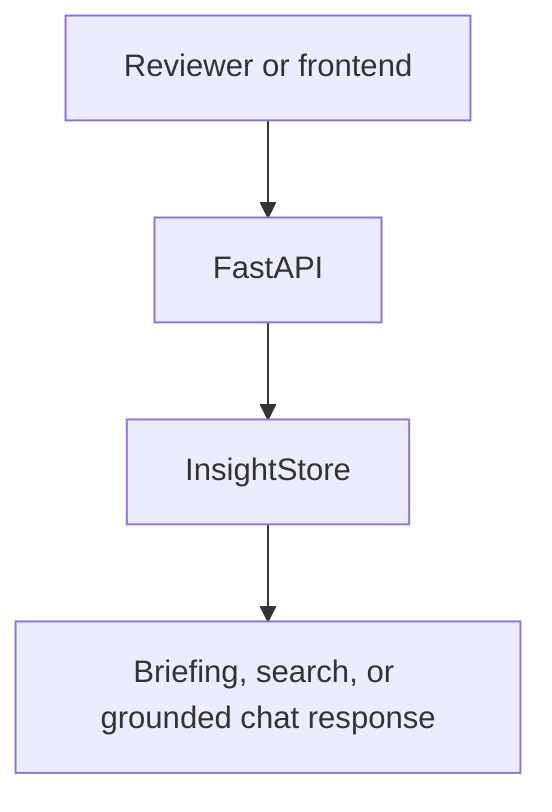
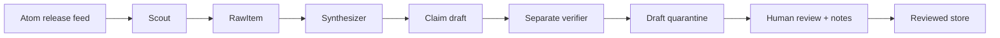
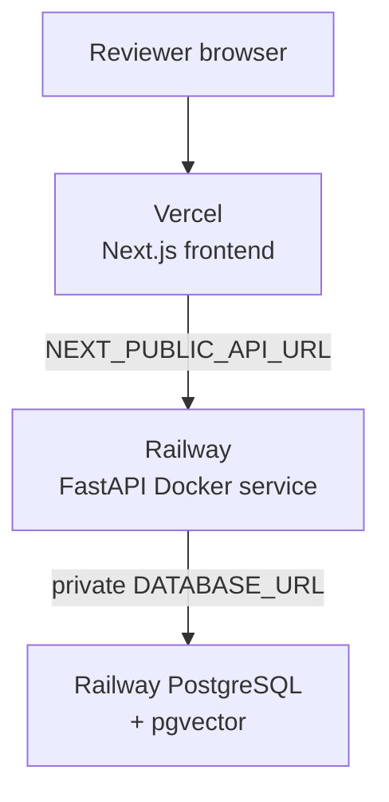

# Architecture — Deep Dive

DRIFT is a release-intelligence workbench for GPU and AI-infrastructure teams.
This document explains the checked-in architecture visual, the boundaries behind
it, and the evidence required before the live path can be called complete.

The implementation, publication, and current release work are recorded in the
nine [Codex project initiatives](INITIATIVES.md).

> **Current truth:** the fixture path is working and reproducible. The local
> capture job persists/reloads primary source evidence, freezes exact claim
> spans, separately verifies the draft, embeds it, and stores both model-run
> audits. It cannot publish a draft: live read paths admit only human-reviewed,
> verifier-passed records. On 2026-07-15, the prior hosted `v0.5.1` deployment
> migrated Railway PostgreSQL and served one unreviewed vLLM capture through
> `/briefing`. On 2026-07-16, Railway PostgreSQL was verified at migration
> `0003` through its public TCP proxy. Later that day, hosted `v0.6.1`
> `/health`, empty fail-closed `/briefing`, `/docs`, Vercel canonical-banner
> source, and CORS were verified. Four human-reviewed Insights were then
> published and hosted `/briefing`, `/search`, and `/chat` verified
> provider-backed. The API-docs
> banner frame follows the same system light/dark preference as the banners.

## Visual source of truth

The canonical architecture is maintained in
[`assets/architecture/architecture-diagram.mmd`](../assets/architecture/architecture-diagram.mmd).
The checked-in themed renders are the README and presentation assets:

<p align="center">
  <a href="../assets/architecture/architecture-diagram-light.svg" target="_blank" rel="noopener noreferrer">
    <picture>
      <source media="(prefers-color-scheme: dark)" srcset="../assets/architecture/architecture-diagram-dark.svg">
      <source media="(prefers-color-scheme: light)" srcset="../assets/architecture/architecture-diagram-light.svg">
      
    </picture>
  </a>
</p>

Open the [light SVG](../assets/architecture/architecture-diagram-light.svg) or
[dark SVG](../assets/architecture/architecture-diagram-dark.svg) for a scalable
version. The corresponding [light PNG](../assets/architecture/architecture-diagram-light.png)
and [dark PNG](../assets/architecture/architecture-diagram-dark.png) are for
slides and video. Regeneration instructions live in the
[architecture asset guide](../assets/architecture/README.md).

The main diagram stays intentionally horizontal because it describes the
pipeline’s ownership sequence. Supporting diagrams below are kept short or
vertical so they remain readable in Markdown and on a normal screen.

## Pipeline timing and implementation status

There is no honest live timing claim yet. The table records what exists and
what must be demonstrated before each stage moves to complete.

| Stage | Current implementation | Live completion evidence |
| --- | --- | --- |
| Source configuration | `backend/sources.yaml` contains eight curated GitHub Atom feeds | Feed success, timeout, malformed-feed, and retry tests |
| Scout | Bounded feed fetch, normalized `RawItem`, canonical URL dedupe, structured source logging, source-content hash, and async persistence | Scheduled fetch telemetry |
| Synthesizer | Bounded routed embeddings, deterministic cosine clustering, and narrow Tier.DEV severity classification with mocked tests | A reviewed production-quality capture corpus |
| Insight | Typed claims with exact excerpts/offsets/hashes, classified facts/inferences/checks, upstream references, and a generation audit | Paid draft capture with primary evidence |
| Verifier | Separate structured verifier call rejects unsupported or misclassified claims; verifier audit persists | Calibration and human comparison on real captures |
| Review gate | Draft-only persistence; meaningful human notes promote a verifier-passed record | Human-reviewed capture corpus |
| Briefing | Deterministic fixture ranking; live briefing/search/chat filter to reviewed verifier-passed pgvector rows | Scheduled end-to-end population |
| API | Fixture and local live-store adapters work | Reproducible deployed capture path |
| Frontend | Local cards expose review label, claim type/evidence, risk labels, confidence, model/audit label, and source links | Hosted view of review-gated data after redeploy |

## Runtime paths

### Fixture path — complete

```text
backend/fixtures/insights.json
        │
        ▼
InsightStore (read-only, in-memory)
        │
        ├── GET /briefing
        ├── GET /search
        └── POST /chat
```

Fixture mode is the default. It needs no database, network, OpenAI key, or
frontend build. Every record is an explicit example and uses
`model_used: fixture-curated`.

### Live path — target

The main diagram is the authoritative visual for this path:

```text
GitHub Atom feeds → Scout → RawItem → Synthesizer → Claim draft → Verifier
                                                                  │
                                                          draft quarantine
                                                                  │
                                                     human review + notes
                                                                  │
                                     reviewed store → Briefing/search/chat → FastAPI
```

The intended durable store is PostgreSQL with pgvector. The local capture job
provides the controlled Scout → Synthesizer → claim extraction → verification
path, writes insight embeddings and two model-run audits, and keeps the row a
draft until a human records review notes. The local adapter retrieves reviewed,
verifier-passed rows only. On 2026-07-15, the prior hosted code migrated Railway
PostgreSQL, captured one unreviewed vLLM release Insight, and served it through
hosted `/briefing`; that historic deployment does not have this gate and does
not establish broad, reviewed live release analysis.

## Small request flows

### Fixture request flow



### Target ingestion flow



This is intentionally a short supporting flow; the full relationship between
the stages, stores, models, and user is in the checked-in architecture asset.

## Component responsibilities

| Component | Owns | Does not own |
| --- | --- | --- |
| FastAPI app | Lifespan, CORS, HTTP adapters, OpenAPI | Ranking, provider calls, persistence logic |
| Scout | Fetch, normalize, URL dedupe, source telemetry | Severity or explanation |
| Synthesizer | Embeddings, near-duplicate grouping, clustering, narrow classification | Long-form advice |
| Insight | Claim extraction, exact-source-span freezing, confidence, cited bounded action | Evidence not present in source cluster |
| Verifier | Separate model-aided claim screening | Proof or human approval |
| Review gate | Explicit promotion, reviewer notes, public eligibility | Automatic publication or deployment approval |
| Briefing | Deterministic rank, reviewed retrieval, grounded response composition | Unretrieved model knowledge or draft data |
| Model router | Tier-to-provider model mapping | Business logic in individual agents |
| SpendGuard | Reservation, settlement, alert, hard ceiling | Provider billing controls |
| Next.js frontend | Display and API wiring | Secrets, source truth, model calls |

Agents use the small lifecycle contract in
[`backend/agents/base.py`](../backend/agents/base.py). The project chooses
explicit typed stages over a general-purpose orchestration framework so every
boundary is easy to inspect and mock.

## Domain contracts and provenance

The Pydantic contracts live in
[`backend/models/schema.py`](../backend/models/schema.py).

### RawItem

```text
id · source_id · title · url · published_at · raw_content · content_sha256 · fetched_at
```

The canonical URL is the deduplication key. `raw_content` is untrusted source
data and must be preserved with retrieval timestamps for reproducible reasoning.

### Insight

```text
id · raw_item_ids[] · title · summary · why_it_matters · what_to_check
severity · affected_libraries[] · source_citations[] · confidence
model_used · claims[{kind, evidence[{excerpt, offsets, source hash, refs}]}]
upstream_release_type · operator_risks[] · applicability_conditions[]
publication_status · verification_status · review/model audit provenance · created_at
```

An insight is not displayable unless it has:

1. one or more primary-source citations and frozen exact evidence spans;
2. a type for each statement: `direct_fact`, `inference`, or `recommended_check`;
3. confidence in `[0, 1]` and an exact model identifier or fixture audit label;
4. a concrete, bounded `what_to_check` action; and
5. in live mode, `verification_status=passed`, `publication_status=reviewed`,
   and recorded human review notes before it is returned publicly.

The local capture database keeps raw items, insights, embeddings, and model-run
audit data durable:

| Record | Purpose |
| --- | --- |
| `sources` | Curated feed list and enabled state |
| `raw_items` | Source evidence, fetch metadata, and source-content hash |
| `insights` | User-facing contract, claim/evidence JSON, risk/applicability metadata, publication/verification status, embedding, two model-run pointers, and review notes |
| `model_runs` | Operation, model, evidence/output hashes, usage, bounded settlement, and attempts |

A citation URL alone is not sufficient provenance if the source content,
retrieval time, immutable source span/hash, cross-reference, and model/audit
record cannot be recovered.

Reviewed notebook captures may also be exported as dated records under
`assets/evidence/`. The export contains public Insight fields, frozen claim
evidence, and safe capture counts, omits human review notes/secrets, and writes
a SHA-256 manifest. It refuses draft/unverified rows and archive overwrites.

## API surface

| Endpoint | Contract | Current behavior |
| --- | --- | --- |
| `GET /health` | status, mode, version | Working |
| `GET /briefing?top_n=1..10` | `BriefingItem[]` | Fixture ranking by default; live mode ranks reviewed verifier-passed rows only |
| `GET /search?q=2..300 chars` | `Insight[]` | Fixture token relevance by default; live mode uses query embeddings/pgvector over reviewed verifier-passed rows only |
| `POST /chat` | `ChatRequest → ChatResponse` | Fixture composition by default; retrieve-first model answer from reviewed verifier-passed evidence in live mode |
| `GET /docs` | Swagger UI | Generated OpenAPI UI with the canonical theme-aware DRIFT banner |
| `GET /brand/{dark\|light}.svg` | Canonical hero banner | Served from `assets/brand/`; excluded from the OpenAPI contract |
| `GET /openapi.json` | OpenAPI document | FastAPI-generated; not checked in |

The chat path retrieves matching insights first. If no matching evidence exists,
it returns an evidence-not-found response rather than answering from general
model knowledge. In `DRIFT_MODE=live`, the `live` tier answers from the
retrieved, citation-bearing evidence. In the current local code, live
`/briefing`, `/search`, and `/chat` filter persisted `insights` to reviewed,
verifier-passed rows; search and chat use pgvector retrieval. Fixture mode
remains the no-key path. The hosted deployment served one unreviewed captured
vLLM Insight through `/briefing` on 2026-07-15 before this gate was implemented.
On 2026-07-16, an eight-source capture produced six verifier-passed drafts;
four were published after human review, and hosted `/briefing`, `/search`, and
`/chat` were verified provider-backed over those four reviewed Insights.

## Model, budget, and safety boundaries

Provider calls belong behind
[`backend/core/model_router.py`](../backend/core/model_router.py). The intended
tiers are:

| Tier | Intended use | Guardrail |
| --- | --- | --- |
| `dev` / Luna | Classification, clustering, prompt iteration | Small outputs and mocked tests |
| `live` / Terra | Retrieve-first grounded chat | Retrieval required before call |
| `final` / Sol | Three to five reviewed examples | Deliberate, capped usage |

Release text is data, never model instructions. Prompt construction must keep
source text inside an explicit data boundary and tests must include
prompt-injection-shaped release text. A high `security` or `breaking` severity
raises review priority; it never authorizes automation.

### Product truth boundary

DRIFT promises traceable primary-source facts, explicitly labelled
interpretations, and bounded recommended checks. It does not promise a
compatibility verdict, incident prediction, release completeness, or that a
model verifier proves a claim. `upstream_release_type` records the source's
declared release shape; `operator_risks` records a conditional operational
interpretation. The UI and API keep those concepts separate.

`SpendGuard` reserves a retry envelope before every provider call, settles
reported Responses and embedding token usage when available, and conservatively
settles a call cap when usage/pricing is not available. It alerts at the
configured threshold and blocks the project ceiling; it does not replace
provider-side account limits or secret management. Complete Scout evidence is
stored unchanged, while only the derived source text used for clustering
embeddings is bounded before the provider call.

### Provider-call resilience

The synchronous capture calls apply client timeout → retry-envelope reservation
→ transient retry with jitter → circuit breaker → settlement. Interactive live
chat additionally applies a queue timeout and concurrency bulkhead:

```text
queue timeout → concurrency bulkhead → retry-envelope reservation
→ per-attempt timeout/retry with jitter → circuit breaker → cost settlement
```

The OpenAI SDK's own retries are disabled so the application's retry budget is
the only retry authority. Transient connection, timeout, rate-limit, and 5xx
failures retry up to the configured attempt limit; input and authentication
errors fail immediately. After repeated transient failures the circuit opens,
then permits one recovery probe after its cooldown. If a cancelled or failed
attempt might have reached the provider, DRIFT settles its configured maximum
cost rather than silently releasing that budget.

The bulkhead and circuit are process-local. They protect this single-process
demo service; horizontally scaled production use still needs shared rate limits,
durable spend accounting, and provider-side quotas.

## Failure handling

| Failure | Required behavior |
| --- | --- |
| Feed unavailable | Bounded retry, structured error, preserve last good record |
| Malformed feed | Reject the item, record source error, continue other sources |
| Duplicate URL | Keep one canonical source record |
| Model timeout or retryable provider failure | Retry only within the configured application budget; then return a clear failure and never emit an ungrounded insight |
| Invalid structured output | Retry within budget or reject; never silently coerce evidence |
| No retrieval match | Return evidence-not-found |
| Budget exceeded | Block before the provider call |
| Live-chat capacity exhausted or circuit open | Return retryable `503` with `Retry-After`; do not reserve budget until a bulkhead slot is acquired |
| Live-chat provider failure after retries | Return `502` without provider details and settle potentially billable attempts conservatively |
| Database unavailable | Clear service error; fixture mode remains independently usable |

## Deployment topology



The prepared deployment uses Vercel for `frontend/` and Railway for the root
FastAPI Docker service. The public frontend is
[`https://dr1ftless.vercel.app`](https://dr1ftless.vercel.app), and Railway’s
$5 plan is a small-demo budget constraint, not a production availability
guarantee. The verified Railway API is
[`https://drift-api-prod.up.railway.app`](https://drift-api-prod.up.railway.app),
with `/health`, `/docs`, and `/openapi.json` exposed publicly. As of
2026-07-16, its `v0.6.1` live mode, `/docs`, provider-backed
`/briefing`/`/search`/`/chat` over four reviewed Insights, and Vercel CORS
configuration are verified. The Vercel HTML references the canonical API-served
banner pair. See
[ADR-007](adr/007-vercel-railway-deployment.md).

The browser can consume the hosted API from Vercel. On 2026-07-15, Vercel CORS
and a populated hosted `/briefing` response were verified against the migrated
pre-gate Railway store. On 2026-07-16, the `0003` schema and hosted `v0.6.1`
application were verified; after four human-reviewed Insights were published,
`/briefing`, `/search`, and `/chat` were verified provider-backed over that
bounded reviewed set. This is not broad live-release analysis.

The generated Swagger contract keeps route ownership visible through four
groups: `system` for metadata and liveness, `briefing` for ranked insights,
`search` for cited retrieval, and `chat` for grounded questions.

## Verification and readiness

The repository quality sequence is:

```text
Ruff → mypy → pytest + coverage → Codecov upload → frontend build → docs hygiene
```

The enforceable floor is 100% for implemented code; the current local suite is
148 tests at 100.00%. Deliberately unimplemented live-stage raises remain explicit and are
excluded only at the boundary itself. New live behavior must arrive with tests
that preserve the 100% floor.

Before the live path is called complete:

- [ ] migrations apply to a clean PostgreSQL instance;
- [x] feed success, timeout, malformed, and duplicate cases are tested;
- [x] local live-chat provider calls are behind the router and mocked;
- [x] local live-chat source text is tested as untrusted data;
- [x] standalone generated Insights satisfy the provenance contract in mocked
      provider tests;
- [x] the local capture code persists source hashes, frozen claim spans,
      upstream cross-references, generation/verifier model-run metadata,
      embeddings, and draft publication status;
- [x] unsupported-claim, ambiguity, and prompt-injection calibration cases are
      covered with mocked provider tests;
- [x] live retrieval filters to human-reviewed verifier-passed rows;
- [x] local live pgvector retrieval constrains chat context;
- [x] local live-chat budget, capacity, and provider failures are tested; and
- [ ] a paid, human-reviewed controlled end-to-end run is saved and repeatable.

## Decision records

The ADR index is [`docs/adr/README.md`](adr/README.md):

- [ADR-001 — fixture-first judge path](adr/001-fixture-first-judge-path.md)
- [ADR-002 — typed stages without a framework](adr/002-typed-agents-no-framework.md)
- [ADR-003 — citations and visible uncertainty](adr/003-citations-and-visible-uncertainty.md)
- [ADR-004 — local budget guard](adr/004-local-budget-guard.md)
- [ADR-005 — PostgreSQL and pgvector](adr/005-postgres-pgvector-live-store.md)
- [ADR-006 — CI gates and coverage ratchet](adr/006-ci-quality-gates.md)
- [ADR-007 — Vercel and Railway deployment](adr/007-vercel-railway-deployment.md)
- [ADR-008 — live grounded chat over the fixture store](adr/008-live-grounded-chat.md)
- [ADR-009 — bounded model resilience and locked delivery](adr/009-bounded-model-resilience-and-locked-delivery.md)
- [ADR-010 — claim evidence and review-first publication](adr/010-claim-evidence-and-review-gate.md)

When a boundary changes, amend the relevant ADR or add a new one. Do not hide
an unfinished implementation by rewriting decision history.
