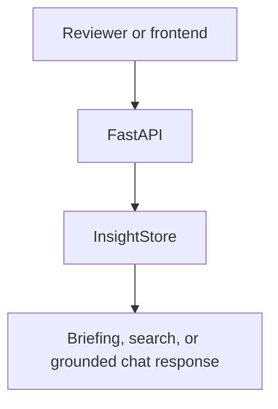
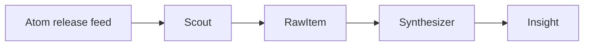
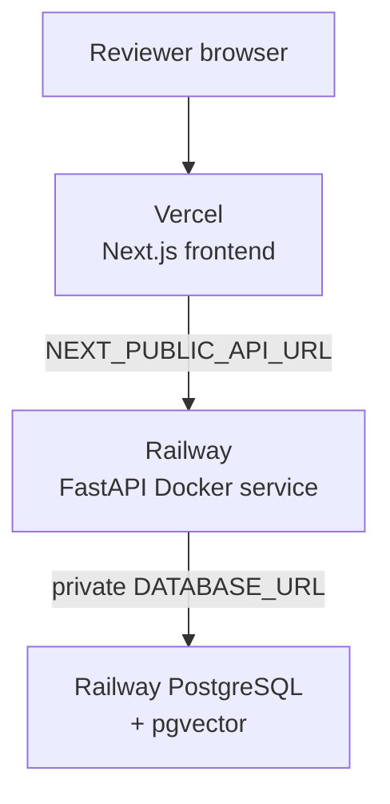

# Architecture — Deep Dive

DRIFT is a release-intelligence workbench for GPU and AI-infrastructure teams.
This document explains the checked-in architecture visual, the boundaries behind
it, and the evidence required before the live path can be called complete.

The implementation, publication, and current release work are recorded in the
five [Codex project initiatives](INITIATIVES.md).

> **Current truth:** the fixture path is working and reproducible, local live
> chat is bounded to cited fixture evidence, and the hosted browser API path
> is connected. Feed scheduling, durable live-store integration/retrieval,
> embedding persistence, and generated Insight model output remain
> implementation boundaries.

## Visual source of truth

The canonical architecture is maintained in
[`assets/architecture/architecture-diagram.mmd`](../assets/architecture/architecture-diagram.mmd).
The checked-in themed renders are the README and presentation assets:

<p align="center">
  <a href="../assets/architecture/architecture-diagram-light.svg" target="_blank" rel="noopener noreferrer">
    <picture>
      <source media="(prefers-color-scheme: dark)" srcset="../assets/architecture/architecture-diagram-dark.svg">
      <source media="(prefers-color-scheme: light)" srcset="../assets/architecture/architecture-diagram-light.svg">
      
    </picture>
  </a>
</p>

Open the [light SVG](../assets/architecture/architecture-diagram-light.svg) or
[dark SVG](../assets/architecture/architecture-diagram-dark.svg) for a scalable
version. The corresponding [light PNG](../assets/architecture/architecture-diagram-light.png)
and [dark PNG](../assets/architecture/architecture-diagram-dark.png) are for
slides and video. Regeneration instructions live in the
[architecture asset guide](../assets/architecture/README.md).

The main diagram stays intentionally horizontal because it describes the
pipeline’s ownership sequence. Supporting diagrams below are kept short or
vertical so they remain readable in Markdown and on a normal screen.

## Pipeline timing and implementation status

There is no honest live timing claim yet. The table records what exists and
what must be demonstrated before each stage moves to complete.

| Stage | Current implementation | Live completion evidence |
| --- | --- | --- |
| Source configuration | `backend/sources.yaml` contains eight curated GitHub Atom feeds | Feed success, timeout, malformed-feed, and retry tests |
| Scout | Bounded feed fetch, normalized `RawItem`, canonical URL dedupe, structured source logging, and async raw-item persistence helper | Persisted fetch telemetry and controlled end-to-end scheduling |
| Synthesizer | Routed embeddings, deterministic cosine clustering, and narrow Tier.DEV severity classification with mocked tests | Persisted vectors, live-store retrieval, and controlled end-to-end scheduling |
| Insight | Contract and prompt boundary prepared | Structured output validation, citations, confidence, and provenance tests |
| Briefing | Deterministic fixture ranking, retrieval, and bounded grounded live chat work over the fixture store | Live-store and pgvector retrieval-backed ranking |
| API | Fixture FastAPI surface works | Live repository adapter and reproducible deployment |
| Frontend | Local Next.js briefing view builds | Hosted view at `https://dr1ftless.vercel.app`; browser API fetch and CORS verified |

## Runtime paths

### Fixture path — complete

```text
backend/fixtures/insights.json
        │
        ▼
InsightStore (read-only, in-memory)
        │
        ├── GET /briefing
        ├── GET /search
        └── POST /chat
```

Fixture mode is the default. It needs no database, network, OpenAI key, or
frontend build. Every record is an explicit example and uses
`model_used: fixture-curated`.

### Live path — target

The main diagram is the authoritative visual for this path:

```text
GitHub Atom feeds → Scout → RawItem → Synthesizer → Insight → Briefing → FastAPI
                                      │              │
                                      └─ embeddings  └─ citations + bounded action
```

The intended durable store is PostgreSQL with pgvector. The Day 1 feed
normalization and schema/migration foundation now exist, but generated Insight
records, saved provenance, live-store retrieval, and a controlled end-to-end
run remain incomplete. `DRIFT_MODE=live` currently enables only model-backed
chat over the cited fixture store.

## Small request flows

### Fixture request flow



### Target ingestion flow



This is intentionally a short supporting flow; the full relationship between
the stages, stores, models, and user is in the checked-in architecture asset.

## Component responsibilities

| Component | Owns | Does not own |
| --- | --- | --- |
| FastAPI app | Lifespan, CORS, HTTP adapters, OpenAPI | Ranking, provider calls, persistence logic |
| Scout | Fetch, normalize, URL dedupe, source telemetry | Severity or explanation |
| Synthesizer | Embeddings, near-duplicate grouping, clustering, narrow classification | Long-form advice |
| Insight | Structured explanation, confidence, citations, bounded action | Evidence not present in source cluster |
| Briefing | Deterministic rank, retrieval, grounded response composition | Unretrieved model knowledge |
| Model router | Tier-to-provider model mapping | Business logic in individual agents |
| SpendGuard | Reservation, settlement, alert, hard ceiling | Provider billing controls |
| Next.js frontend | Display and API wiring | Secrets, source truth, model calls |

Agents use the small lifecycle contract in
[`backend/agents/base.py`](../backend/agents/base.py). The project chooses
explicit typed stages over a general-purpose orchestration framework so every
boundary is easy to inspect and mock.

## Domain contracts and provenance

The Pydantic contracts live in
[`backend/models/schema.py`](../backend/models/schema.py).

### RawItem

```text
id · source_id · title · url · published_at · raw_content · fetched_at
```

The canonical URL is the deduplication key. `raw_content` is untrusted source
data and must be preserved with retrieval timestamps for reproducible reasoning.

### Insight

```text
id · raw_item_ids[] · title · summary · why_it_matters · what_to_check
severity · affected_libraries[] · source_citations[] · confidence
model_used · created_at
```

An insight is not displayable unless it has:

1. one or more primary-source citations;
2. confidence in `[0, 1]`;
3. an exact model identifier or explicit fixture audit label; and
4. a concrete, bounded `what_to_check` action.

The planned live database keeps raw items, insights, embeddings, and model-run
audit data durable:

| Record | Purpose |
| --- | --- |
| `sources` | Curated feed list and enabled state |
| `raw_items` | Source evidence and fetch metadata |
| `insights` | User-facing contract plus embedding/provenance pointer |
| `model_runs` | Tier, model, latency, usage, cost estimate, and outcome |

A citation URL alone is not sufficient provenance if the source content,
retrieval time, and model/audit record cannot be recovered.

## API surface

| Endpoint | Contract | Current behavior |
| --- | --- | --- |
| `GET /health` | status, mode, version | Working |
| `GET /briefing?top_n=1..10` | `BriefingItem[]` | Working; severity/confidence/recency ranking |
| `GET /search?q=2..300 chars` | `Insight[]` | Working; fixture token relevance |
| `POST /chat` | `ChatRequest → ChatResponse` | Fixture composition by default; retrieve-first model answer in live mode |
| `GET /docs` | Swagger UI | FastAPI-generated |
| `GET /openapi.json` | OpenAPI document | FastAPI-generated; not checked in |

The chat path retrieves matching insights first. If no matching evidence exists,
it returns an evidence-not-found response rather than answering from general
model knowledge. In `DRIFT_MODE=live`, the `live` tier answers from the
retrieved, citation-bearing fixture evidence; pgvector retrieval remains future
work.

## Model, budget, and safety boundaries

Provider calls belong behind
[`backend/core/model_router.py`](../backend/core/model_router.py). The intended
tiers are:

| Tier | Intended use | Guardrail |
| --- | --- | --- |
| `dev` / Luna | Classification, clustering, prompt iteration | Small outputs and mocked tests |
| `live` / Terra | Retrieve-first grounded chat | Retrieval required before call |
| `final` / Sol | Three to five reviewed examples | Deliberate, capped usage |

Release text is data, never model instructions. Prompt construction must keep
source text inside an explicit data boundary and tests must include
prompt-injection-shaped release text. A high `security` or `breaking` severity
raises review priority; it never authorizes automation.

`SpendGuard` reserves estimated cost before a provider call, settles actual
usage, alerts at the configured threshold, and blocks the project ceiling. It
does not replace provider-side account limits or secret management.

### Live chat resilience

The bounded local live-chat path applies these controls in order:

```text
queue timeout → concurrency bulkhead → retry-envelope reservation
→ per-attempt timeout/retry with jitter → circuit breaker → cost settlement
```

The OpenAI SDK's own retries are disabled so the application's retry budget is
the only retry authority. Transient connection, timeout, rate-limit, and 5xx
failures retry up to the configured attempt limit; input and authentication
errors fail immediately. After repeated transient failures the circuit opens,
then permits one recovery probe after its cooldown. If a cancelled or failed
attempt might have reached the provider, DRIFT settles its configured maximum
cost rather than silently releasing that budget.

The bulkhead and circuit are process-local. They protect this single-process
demo service; horizontally scaled production use still needs shared rate limits,
durable spend accounting, and provider-side quotas.

## Failure handling

| Failure | Required behavior |
| --- | --- |
| Feed unavailable | Bounded retry, structured error, preserve last good record |
| Malformed feed | Reject the item, record source error, continue other sources |
| Duplicate URL | Keep one canonical source record |
| Model timeout or retryable provider failure | Retry only within the configured application budget; then return a clear failure and never emit an ungrounded insight |
| Invalid structured output | Retry within budget or reject; never silently coerce evidence |
| No retrieval match | Return evidence-not-found |
| Budget exceeded | Block before the provider call |
| Live-chat capacity exhausted or circuit open | Return retryable `503` with `Retry-After`; do not reserve budget until a bulkhead slot is acquired |
| Live-chat provider failure after retries | Return `502` without provider details and settle potentially billable attempts conservatively |
| Database unavailable | Clear service error; fixture mode remains independently usable |

## Deployment topology



The prepared deployment uses Vercel for `frontend/` and Railway for the root
FastAPI Docker service. The public frontend is
[`https://dr1ftless.vercel.app`](https://dr1ftless.vercel.app), and Railway’s
$5 plan is a small-demo budget constraint, not a production availability
guarantee. The verified Railway API is
[`https://drift-api-prod.up.railway.app`](https://drift-api-prod.up.railway.app),
with `/health`, `/docs`, and `/openapi.json` exposed publicly. As of
2026-07-15, its bounded live mode and Vercel CORS configuration are verified.
See
[ADR-007](adr/007-vercel-railway-deployment.md).

The browser can consume the hosted API from Vercel. The `/briefing` response
still uses committed fixture data; only grounded `/chat` uses the live model
tier when the provider configuration is available.

The generated Swagger contract keeps route ownership visible through four
groups: `system` for metadata and liveness, `briefing` for ranked insights,
`search` for cited retrieval, and `chat` for grounded questions.

## Verification and readiness

The repository quality sequence is:

```text
Ruff → mypy → pytest + coverage → Codecov upload → frontend build → docs hygiene
```

The enforceable floor is 100% for implemented code; the current local suite is
100.00%. Deliberately unimplemented live-stage raises remain explicit and are
excluded only at the boundary itself. New live behavior must arrive with tests
that preserve the 100% floor.

Before the live path is called complete:

- [ ] migrations apply to a clean PostgreSQL instance;
- [ ] feed success, timeout, malformed, and duplicate cases are tested;
- [x] local live-chat provider calls are behind the router and mocked;
- [x] local live-chat source text is tested as untrusted data;
- [ ] every emitted insight satisfies the provenance contract;
- [ ] retrieval constrains chat context;
- [x] local live-chat budget, capacity, and provider failures are tested; and
- [ ] a controlled end-to-end run is saved and repeatable.

## Decision records

The ADR index is [`docs/adr/README.md`](adr/README.md):

- [ADR-001 — fixture-first judge path](adr/001-fixture-first-judge-path.md)
- [ADR-002 — typed stages without a framework](adr/002-typed-agents-no-framework.md)
- [ADR-003 — citations and visible uncertainty](adr/003-citations-and-visible-uncertainty.md)
- [ADR-004 — local budget guard](adr/004-local-budget-guard.md)
- [ADR-005 — PostgreSQL and pgvector](adr/005-postgres-pgvector-live-store.md)
- [ADR-006 — CI gates and coverage ratchet](adr/006-ci-quality-gates.md)
- [ADR-007 — Vercel and Railway deployment](adr/007-vercel-railway-deployment.md)
- [ADR-008 — live grounded chat over the fixture store](adr/008-live-grounded-chat.md)
- [ADR-009 — bounded model resilience and locked delivery](adr/009-bounded-model-resilience-and-locked-delivery.md)

When a boundary changes, amend the relevant ADR or add a new one. Do not hide
an unfinished implementation by rewriting decision history.
